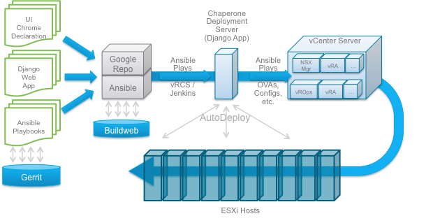

Chaperone Deployment Environment
=====================
Development and deployment require two [Ubuntu Linux 64-bit](http://www.ubuntu.com/download/server) instances:

- **Development Environment (DE)** is the environment where the source code is downloaded, modified and built. 
- **Chaperone Deployment Server (CDS)** is the build target for the development environment.

The Chaperone Deployment server runs the applications used to cvonfigure a vCenter Server environment, so must have access to the environment which it will act on. This file describes deployment options for the Chaperone Deployment Server (CDS). 

##External Deployment
Where firewalls or other security measures would not block access to vCenter Server and the general SDDC infrastructure by Chaperone, the Deployment Server can exist anywhere on any network that can reach the SDDC infrastructure. Examples would be deployment on a developer's desktop using VMware Fusion or Workstation. This option would look like the following:

This configuration requires that the vCenter server management port is exposed on an external ip that is accessible by the CDS server. 

##Internal Deployment
In some cases, such as in One Cloud vPods or on customer premises, the Chaperone Deployment Server needs to exist within the context of vCenter server, i.e. a VM deployed into an on-premises management vCenter instance. That scenario would look similar to the following:

In this case, the CDS ssh port (22) would need to be exposed externally if new builds of the Chaperone GUI(s) were required. Furthermore, if the ssh 
